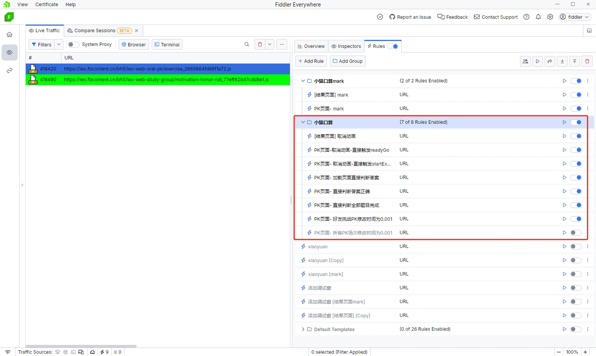

##### 小猿口算自动PK刷题，该项目仅供娱乐

  -  2024-10-16 23:00 可正常使用


## 功能

  -  可以修改PK答题时间为0.001秒
  
  -  取消过渡动画，匹配上就提交答题，可以快速刷分
  

## 工具

 - 抓包工具  ---任何抓包工具都可以，（此处使用fiddler-everywhere，）
  
 - 自动点击工具  ---任意工具都可以，（此处使用AutoX.js，需要安卓模拟器，900*1600，其它分辨率需修改坐标、颜色）

## 思路

 - 使用抓包，正则匹配到PK页面的js文件的请求
   
       ^https:\/\/leo\.fbcontent\.cn\/bh5\/leo-web-oral-pk\/exercise_.*\.js$

 - 使用正则替换请求响应体中的js内容，实现取消过渡动画、修改答题时间0.001秒等（项目里有写好导出的.farx文件）
 
  ```javascript
//取消匹配动画、readyGo动画：
      case 0:if(.{0,14})\.challengeCode(.{200,300})([a-zA-Z]{1,2})\("startExercise"\); 正则替换为 case 0:$3("startExercise");if$1.challengeCode$2
      "readyGoEnd"\)\}\),.{1,4}\)\}\),.{1,4}\)\}\),.{1,4}\)\}\) 正则替换为 "readyGoEnd")}),20)}),20)}),20)})

//好友挑战PK修改时间为0.001：
       correctCnt:(.{1,5}),costTime:(.{1,15}),updatedTime:(.{1,120})([a-zA-Z]{1,2})\.challengeCode  正则替换为  correctCnt:$1,costTime:$4.challengeCode?1:$2,updatedTime:$3$4.challengeCode

//所有PK场次修改时间为0.001
       correctCnt:(.{1,5}),costTime:(.{1,15}),updatedTime:(.{1,120})([a-zA-Z]{1,2})\.challengeCode   正则替换为  correctCnt:$1,costTime:1,updatedTime:$3$4.challengeCode

//判断任何答案正确：
      return .{3,5}\)\?1:0\}, 正则替换为 return 1},

//自动触发答题：
      =function\(([a-zA-Z]{1,2}),([a-zA-Z]{1,2})\)\{([a-zA-Z]{1,2})&&\(([a-zA-Z]{1,2})\.value= 正则替换为 =function($1,$2){$2({ recognizeResult: "", pathPoints: [[]], answer: 1, showReductionFraction: 0 });$3&&($4.value=

//直接判断所有答题完成：
      \.value\+1>=[a-zA-Z]{1,2}\.value\.length\?([a-zA-Z]{1,2})\("finishExercise"\) 正则替换为 .value+1>=0?$1("finishExercise")

 ```

    *注意修改后要清除小猿口算APP缓存才会生效





## 演示视频 :movie_camera:
https://github.com/user-attachments/assets/e908d25e-6fb8-479e-b72f-d22b2fad7782


## 注意

### 修改抓包数据后注意清理小猿APP缓存


